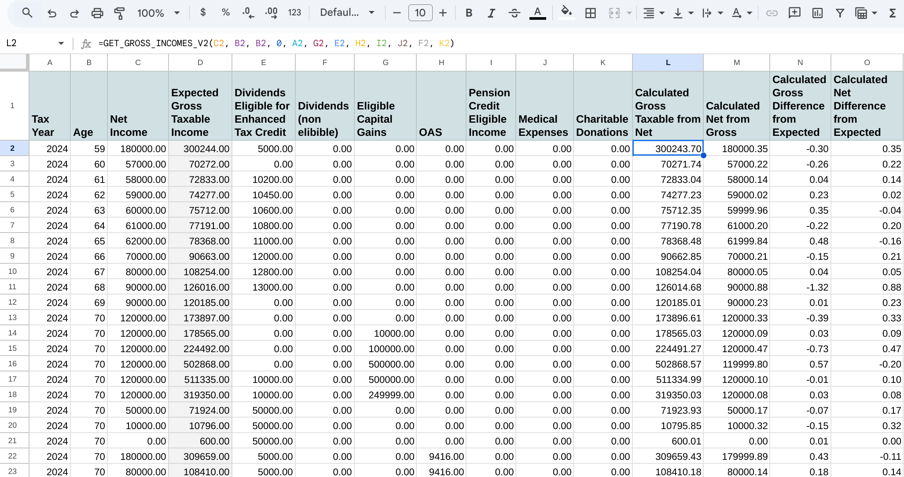

[](https://sonarcloud.io/summary/new_code?id=demmings_CanadianTaxes)
[](https://deepsource.io/gh/demmings/CanadianTaxes/?ref=repository-badge)
[](https://sonarcloud.io/summary/new_code?id=demmings_CanadianTaxes)
[](https://sonarcloud.io/summary/new_code?id=demmings_CanadianTaxes)
[](https://sonarcloud.io/summary/new_code?id=demmings_CanadianTaxes)
[](https://sonarcloud.io/summary/new_code?id=demmings_CanadianTaxes)
[](https://deepscan.io/dashboard#view=project&tid=20362&pid=28447&bid=917017)


# CanadianTaxes

## Purpose

* A Google Sheets custom function used for doing retirement income projections and taking Canadian taxes into the equation.
* Take a column of **NET INCOMES** and calculate as accurately as possible the amount of **GROSS INCOMES** that would be required in **Canada** (and **ONTARIO**) to have the required net income.
* There is also the option of doing the opposite on finding net incomes from gross incomes.
* The factors taken into consideration for finding gross/net income:
  * Regular taxable income (like RRSP, CPP, OAS,...)
  * Age credits
  * Capital gains
  * Eligible Canadian Dividends
  * OAS clawbacks
  * Pension credit eligible income
  * Medical Expenses


## Installing

* Googles guide to adding custom functions: [Google Help](https://developers.google.com/apps-script/guides/sheets/functions#creating_a_custom_function)
* Copy files manually.
* In the ./dist folder there is one file.  Only one is required.  
    * [CanadianTaxes.js](https://github.com/demmings/CanadianTaxes/blob/main/dist/CanadianTaxes.js)
        * This file is an amalgamation of the files in the **/src** folder.
        * Therefore do NOT use the files in **/src** folder.
* The simple approach is to copy and paste **CanadianTaxes.js**.
    * From your sheets Select **Extensions** and then **Apps Script**
    * Ensure that Editor is selected.  It is the **< >**
    * Click the PLUS sign beside **File** and then select **Script**
    * Click on [CanadianTaxes.js](https://github.com/demmings/CanadianTaxes/blob/main/dist/CanadianTaxes.js), and then click on **Copy Raw Contents** which puts the file into your copy buffer.
    * Back in your Google Project, rename **Untitled** to the file name you just selected in Github.  It is not necessary to enter the .gs extension.
    * Remove the default contents of the file **myFunction()** and paste in the new content you have copied from Github (Ctrl-v).
    * Click the little diskette icon to save.
    * Change to your spreadsheet screen and try typing in any cell
    * ```=CanadianTaxes()``` or ```=CanadianTaxesS()```.  The new function with online help should be available.

## Using

* **=TEST_CANTAX()**
  * This custom function does an internal check and outputs the results.  Ensure there are enough empty lines below so that the custom function can expand the results.
  * The test data is using 2024 tax bracket data.  The expected results column is calculated manually using the TaxTips.ca website.  https://www.taxtips.ca/calculators/canadian-tax/canadian-tax-calculator.htm

* **=GET_GROSS_INCOMES_V2(income, ageInFuture, currentAge, projectedInflation, taxYear, projectedGains, projectedDividends , yearlyOAS, incomeEligibleForPensionCredit, medicalExpenses, nonEligibleDividends, donations)**
   * Process a column of yearly NET INCOMES and return a column of GROSS INCOMES.
   * The GROSS INCOME is the total income from taxable sources like:  pension, RRSP, RRIF, LIF, CPP, OAS (but sources of income used as parameters to the function ARE NOT included in the total - they are used to find total tax payable)
   * The capital gains and dividends are not include in the gross income. They used to find the total tax payable.
   * The 'currentAge' uses the CURRENT TAX RATES, but future years the tax brackets are adjusted by inflation.  The assumption is that if the net income stayed the same over time, the gross income required to process that net amount will DROP.
   * **Parameters**
     * **income** - array of net income
     * **ageInFuture** - array of retiree age for given net income. 
     * **currentAge** - present day age of retiree
     * **projectedInflation** - long term projected inflation rate - used to adjust TAX BRACKETS only.
       * We use the TAX RATES for the starting year, but can only guess the tax rates of future years.  The basic personal exeption and tax brackets are adjusted by this inflation amount.
     * **taxYear** - tax year of present day retiree.  Used to adjust tax brackets.
     * **projectedGains** - amount of assets sold each year subject to capital gains tax
     * **projectedDividends** - amount of dividends received each year
     * **yearlyOAS** - Old Age Security amount.  Used to determine clawback (which is counted as a tax)
     * **incomeEligibleForPensionCredit** - Pension credit eligible income.  This will add to the tax credits up to a specific amount.
     * **medicalExpenses** - Expected yearly medical expenses
     * **nonEligibleDividends** - non eligible dividends (for enhanced credits)
     * **donations** - charitable donations

   * **returns**  - GROSS Income from ALL taxable sources EXCLUDING capital gains and dividends, but including RRSP, CPP, OAS, ...(all taxable sources)
     * Basically, we are trying to find how much to withdraw from RRSP so RRSP = gross - (CPP + OAS + other taxable sources)
     * You can enter a single value rather than a column and the function will expand and inflate those values for each year.  
       * e.g. You are projecting for 30 years and you enter $4,000 into the medical expenses column.  The function will use 4,000 for the first year and then expand for the following 29 years and inflate (using the inflation value entered).
        * Applicable to the following columns:
          * incomes 
          * ageInFuture (incremented, not inflated)
          * capitalGains
          * eligibleDividends 
          * nonEligibleDividends
          * OAS 
          * incomeEligibleForPensionCredit 
          * medicalExpenses 
          * charitableDonations 

  
 * **GET_NET_INCOMES_V2(yearlyGrossIncome, ageInFuture, currentAge, inflation, taxYear, capitalGains, dividendIncome, OAS, pension, medicalExpenses)**
   * **Parameters** - The sames as GET_GROSS_INCOMES_V2, except the first parameter would contain gross incomes and net incomes are calculated.

## Example Usage

```=GET_GROSS_INCOMES_V2(B2:B28, A2:A28, 60, 2, 2024, E2:E28, D2:D28, F2:F28, G2:G28)```

  * B2:B28 - net income column
  * A2:A28 - the retiree age in the future
  * 60 - the current age (60) of the retiree
  * 2 - projected 2% inflation rate
  * 2024 - the current tax year (2024) for the 60 year old retiree
  * E2:E28 - expected captial gains for the year
  * D2:D28 - expected eligible dividends for the year
  * F2:F28 - expected OAS for the year
  * G2:G28 - income that qualifies for the pension credit

## Example Screenshot

# Example Use



## Example Case for GET_GROSS_INCOMES_V2() vs. Taxtips.ca (2024 tax year)

**=GET_GROSS_INCOMES_V2(50000, 70, 70, 0, 2024, 0, 5000, 9416, 2000, 0)**
* This example is for a 70 year old in 2024 tax year.
* We want a net income of **$50,000**
* We have earned **$5,000** in dividends
* We have received **$9,416** in old age security payments (OAS)
* **$2,000** of our total income is from pension credit eligible taxable income.
* No medical expenses.

Results ==>  **58,824.22**

* Taxtips data entry and interpretation of results.
* [TaxTips.ca](https://www.taxtips.ca/calculators/canadian-tax/canadian-tax-calculator.htm)
  * Enter the following fields: 
    * Taxpayer birthyear ==> **1954**
    * Are you single? ==> **yes**
    * Old Age Security (OAS) (T4A(OAS) box 18) ==> **9,416**
    * Cdn dividends eligible for enhanced div tax credit (T5 box 24) ==> **5,000**
    * RRSP/RRIF withdrawals (when not eligible for pension tax credit) ==> **47,408**
      * The $58,824 is our total taxable gross income.  All of our taxable lines must add up to this value.
        * RRSP/RRIF = 58,824 - 9,416 (oas) - 2,000 (pension) ==>  $47,408 
    * Pension income (eligible for pension tax credit for persons 65+, pension splitting) ==> **2,000**
  * See results of calculation at bottom:
    * Total taxes, clawbacks, CPP/EI premiums ==> **8,824**

### Results Interpretation.
  * RRSP Withdrawal = 58,824 - (9416 + 2000) =  **$47,408**  
    * If there is other taxable income such as CPP or taxable annuities, those amounts should be deducted from 58,824 to find the actual RSP withdrawal
  * Our Net Income = 58,824 - 8,824 (taxes) = **$50,000**
  * The entire purpose of **GET_GROSS_INCOMES_V2()** is to find how much to be withdrawn from our RRSP and then subtract these amounts from our projected RRSP total asset value until we arrive at a specific value at some point in the future.
  * For example, you may wish to have ZERO RRSP assets the year after your turn 85 - so you can solve for that.
    * For my approach to RRSP meltdown strategy, see (https://demmings.github.io/canadiantaxes/2024/12/10/DIY-Calculating-future-RRSP-withdrawals.html)
  * Adding CPP into TAXTIPS.
    * Any other taxable data entered into TAXTIPS - like your CPP - you then need to subtract from **RRSP/RRIF withdrawals** entry - just like we did with the pension income and OAS.
    * The total taxable income for all lines must add up to $58,824 (from our custom function result)
    * The reason we have an OAS parameter to the function and NOT CPP is that CPP is plain taxable income.  OAS is special.  Yes it is added as income but if your income is too high, it is clawed back - which changes our overall tax bill.


## Guiding Principle
* The basic philosophy is that the GROSS INCOME is used to pay all taxes.
* The capital gains, dividends, OAS, pension income is NOT included in the GROSS INCOME calculation.  These values are for adjusting the total tax that is due.
* The inflation rate is ONLY used for adjusting future tax brackets in order to come up with a reasonable tax that would be due.
  * For example, if you have net income of $50,000 this year and also the same amount for next year - the GROSS INCOME required should be less since the brackets would have adjusted upwards for inflation.

##  Known Issues
*  Useful for tax estimation only.  Incomes to the extreme are not super accurate.
   *  Super low incomes in Ontario will generate LIFT credits (for example) which are not calculated here.
   *  Super high incomes may trigger the alternative minimum tax - which is not calculated here.
   *  Future years tax brackets are estimated only.  **It's tough to make predictions, especially about the future.**
*  Only does taxes for Ontario Canada.
    *   I have coded the js so it should be fairly easy to extended support for other provinces.
*  Only 2024, 2025 tax brackets currently entered.
   *  However, even if this data is not updated and you use in a later year (e.g. 2030) - the tax brackets will be adjusted for inflation from last known (in this case 2025).  
*  Only a single year of tax rates are supported - it would be nice to handle this years and next (if known) -  future expansion.
*  Spousal returns are not calculated.
*  Many special credits that many affect your total tax bill are not calculated (at this time).
*  
##  Additional Notes 

[github.io](https://demmings.github.io/)